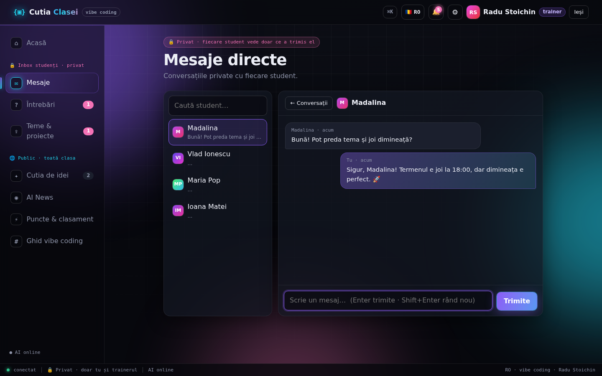
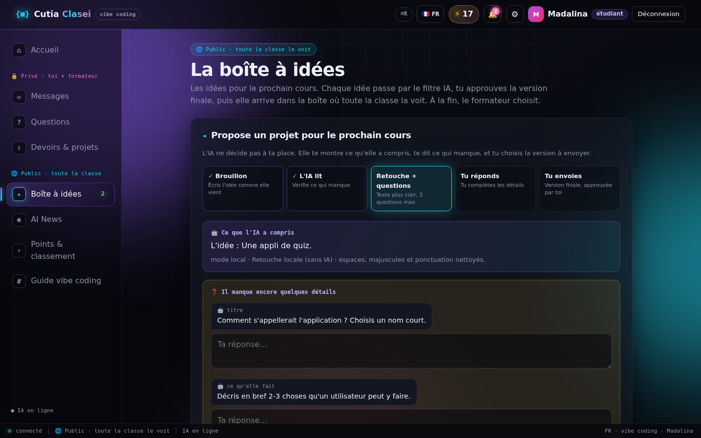
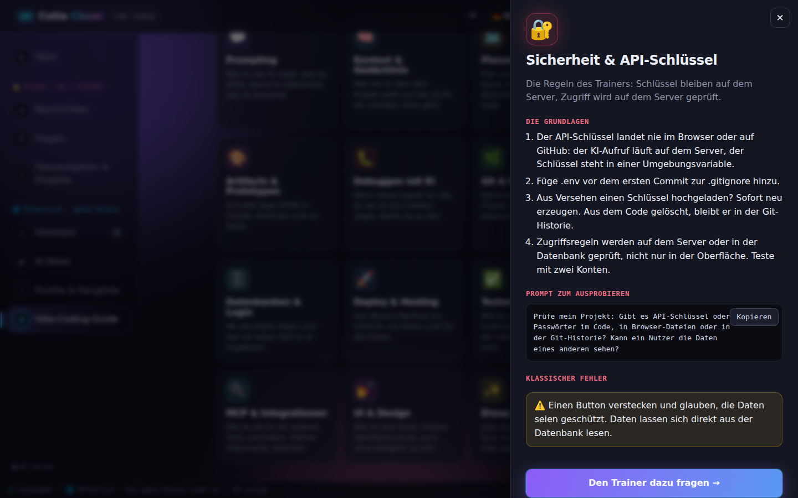
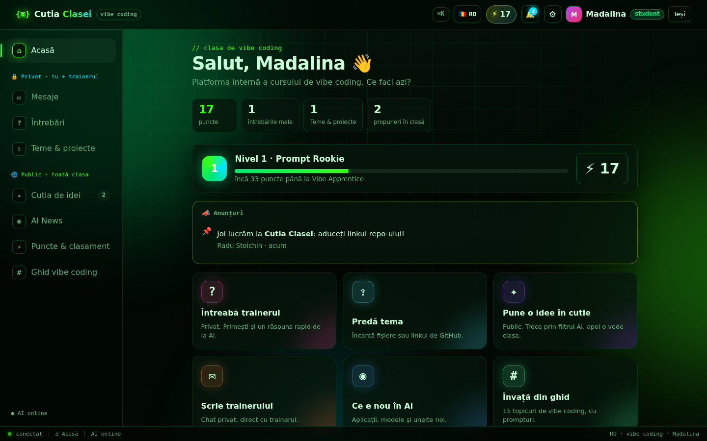
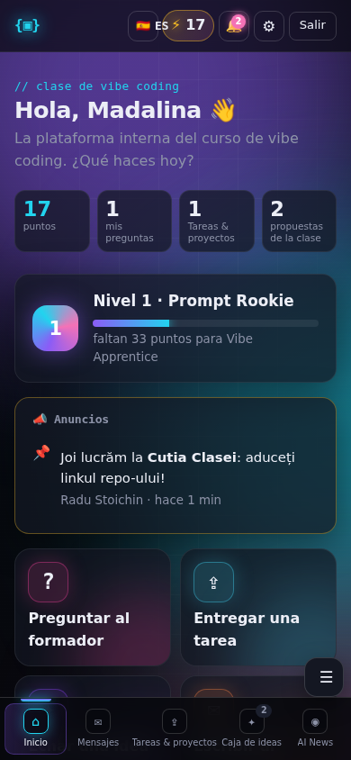

# {▣} Cutia Clasei

**Platforma internă a cursului de vibe coding.** Fiecare student are un spațiu privat cu trainerul (mesaje, întrebări, teme), iar clasa are un spațiu public (cutia de idei cu filtru AI, AI News, clasament, ghid). Interfața merge în **6 limbi** (RO, EN, FR, IT, ES, DE) și are **6 stiluri vizuale**.


## Ce face aplicația

| Spațiu | Ce găsești |
| --- | --- |
| 🔒 **Privat** (doar tu și trainerul) | **Mesaje directe:** chat privat cu trainerul. **Întrebări:** pe topicuri, cu răspuns rapid de la AI și răspunsul oficial al trainerului. **Teme & proiecte:** predai fișiere, linkul GitHub și checklist-ul temei, pentru temele anunțate de trainer (cu termen); primești feedback. |
| 🌐 **Public** (toată clasa) | **Cutia de idei:** AI-ul retușează ideea și cere detalii doar unde lipsesc; tu aprobi; clasa votează; trainerul alege. **AI News:** știri din lumea AI, filtrate pentru clasă. **Puncte & clasament:** niveluri, badge-uri, podium. **Ghid de vibe coding:** 15 topicuri cu prompturi de copiat. |

### Minimul obligatoriu

| Funcție | Cum e implementată |
| --- | --- |
| Pune o întrebare | O văd doar studentul care a pus-o și trainerul (verificat pe server). |
| Răspuns | Trainerul răspunde (sau editează), studentul vede răspunsul. |
| Scrie o propunere | Titlu, ce face aplicația, cine o folosește. |
| Modul AI | Arată ce a înțeles, retușează textul și pune **maxim 3 întrebări**, doar despre ce lipsește: problema, funcțiile, datele, mărimea. |
| Trimite propunerea | Studentul bifează „Am citit și aprob” înainte de trimitere; orice editare cere o nouă aprobare. Serverul refuză propunerile neaprobate. |
| Trainerul alege | Trainerul vede toate propunerile și le marchează „Aleasă”. |

### Funcții în plus

- **Numele tău, automat:** sesiunea rămâne activă (și după repornirea serverului). Aplicația te salută pe nume peste tot, iar la revenire îți spune „Bine ai revenit, Madalina!”.
- **Mesaje directe** student ↔ trainer, cu mesaje necitite și notificări.
- **Teme anunțate de trainer** cu termen, puncte și numărătoare inversă; **anunțuri** fixate pe pagina de acasă.
- **Credite & puncte bonus:** puncte pentru teme (+10), predare la timp (+5), temă revizuită (+20 sau cât stabilește trainerul), idei (+5), voturi primite (+2), idee aleasă (+30), întrebări (+2, max 3/zi) și bonusuri de la trainer. 6 niveluri (Prompt Rookie → AI Wizard), 8 badge-uri, podium și clasament (poți alege să nu apari).
- **AI News:** știri din surse publice despre AI (TechCrunch, The Verge, MIT Technology Review, Ars Technica, VentureBeat, Hugging Face, Google AI, OpenAI, Simon Willison), filtrate după relevanță (aplicații noi, modele, unelte, „wow”), pe categorii. Cu cheie API, Claude alege cele mai bune și explică „de ce contează” în limba ta. Din orice știre: „Trimite trainerului” sau „Fă o idee din asta”.
- **Răspuns rapid de la AI** la fiecare întrebare, marcat „neverificat de trainer”.
- **6 limbi** (RO, EN, FR, IT, ES, DE): interfață, erori de server, texte AI și ghid. Limba aleasă te urmează pe orice dispozitiv.
- **Setări de interfață:** 6 stiluri (Neon, Luminos, Matrix, Apus, Ocean, Contrast mare), animații pornite/oprite, text normal/mare.
- **Ușor de folosit:** pagină de acasă cu acțiuni rapide, tur de bun venit la prima intrare, notificări 🔔, paleta de comenzi `Ctrl+K` (mergi oriunde, schimbi limba sau stilul), `/` pentru căutare, `Ctrl+Enter` pentru trimitere, meniu jos pe telefon.

| Mesaje (trainer) | Puncte & clasament | Cutia de idei (FR) | Ghid (DE) |
| --- | --- | --- | --- |
|  |  |  |  |

| Stilul Matrix | Setări | Telefon (ES) |
| --- | --- | --- |
|  |  |  |

## Cum se pornește

```bash
pip install -r requirements.txt
cp .env.example .env          # opțional: pune ANTHROPIC_API_KEY și TRAINER_CODE aici
uvicorn src.app:app --reload
```

Deschide http://localhost:8000.

- **Student:** intri cu numele și o parolă. Prima dată îți creezi contul, apoi intri cu aceeași parolă.
- **Trainer:** intri cu numele și codul de trainer (`TRAINER_CODE`, implicit `trainer`, schimbă-l!).
- **Fără cheie API** aplicația merge complet: propunerile se retușează local, la întrebări apar sfaturi din ghid, iar știrile sunt filtrate automat (fără explicațiile lui Claude).
- **AI News** are nevoie de acces la internet pe server, ca să citească sursele.

| Variabilă | Implicit | Rol |
| --- | --- | --- |
| `ANTHROPIC_API_KEY` | – | Activează AI-ul (doar pe server). |
| `TRAINER_CODE` | `trainer` | Codul trainerului. |
| `CUTIA_AI` | `auto` | `auto` / `on` / `off` |
| `CUTIA_MODEL` | `claude-opus-5-5` | Modelul Claude. |
| `CUTIA_DATA` | `data/cutia.json` | Unde se salvează datele. |
| `CUTIA_UPLOADS` | `data/uploads` | Unde se salvează fișierele încărcate. |
| `CUTIA_NEWS_FEEDS` | sursele de mai sus | Alte surse: `Nume\|https://...,Nume\|https://...` |
| `CUTIA_NEWS_CACHE` | `7200` | Cât timp (secunde) păstrăm știrile înainte să le recitim. |

**Teste:** `pytest` (acces cu două conturi, mesaje private, puncte, upload, știri, AI și toate cele 6 limbi).

**Aplicația live:** încă nu e publicată online. Linkul apare aici după deploy.

## Securitate

- Cheia API stă doar pe server (variabilă de mediu / `.env`, ignorat de git) și nu ajunge niciodată în browser. Un test verifică asta.
- Toate regulile de acces se verifică pe server și sunt testate cu două conturi: studentul B nu vede întrebările, temele, fișierele sau mesajele studentului A.
- Sesiunile se salvează doar ca hash, iar parolele ca hash PBKDF2. „Ieși” închide sesiunea pe server.
- Punctele se calculează pe server din activitatea reală, nu pot fi modificate din browser; nu îți poți vota propria idee.
- Fișierele se salvează cu nume aleatorii și se descarcă doar ca atașament, după verificarea accesului.
- Știrile din internet sunt tratate ca date: fără HTML, doar linkuri `http(s)`, iar AI-ul le primește ca date, nu ca instrucțiuni.

## Decizii tehnice (motiv → soluție)

- **Cheia API nu are voie în browser** → AI-ul e chemat doar din `src/ai.py` și `src/news.py`, pe server.
- **Spațiul privat trebuie să fie chiar privat** → fiecare endpoint filtrează după autor pe server, plus teste cu două conturi.
- **Punctele trebuie să fie corecte și greu de trișat** → nu se salvează ca număr; `src/points.py` le calculează mereu din teme, idei, voturi și bonusuri.
- **Știrile trebuie să fie relevante, nu zgomot** → filtru pe cuvinte cheie (lansări, unelte, modele, agenți) și penalizare pentru bani, procese și politică; cu cheie, Claude alege și explică.
- **Aplicația trebuie să meargă și fără AI** → mod local pentru retușare, sfaturi din ghid și filtru automat de știri.
- **AI-ul nu decide în locul studentului** → răspuns structurat (JSON), maxim 3 întrebări, trimitere doar cu aprobare verificată pe server.
- **Clasa e internațională** → toate textele în `src/static/i18n/<limbă>.js`; se încarcă doar limba aleasă; un test verifică să nu lipsească nicio traducere.
- **Simplu de rulat la curs** → FastAPI + HTML/CSS/JS fără build; datele într-un fișier JSON.

## Structura

```
src/app.py               API (FastAPI): conturi, mesaje, întrebări, teme, idei, puncte, știri
src/ai.py                Modulul AI (Claude): retușarea ideilor + tutorul pentru întrebări
src/news.py              AI News: surse RSS/Atom, filtrare, cache, alegere cu Claude
src/points.py            Puncte, niveluri și badge-uri
src/static/              Interfața: index.html, app.js, styles.css
src/static/i18n/         Textele în 6 limbi (ro, en, fr, it, es, de)
tests/                   Teste (pytest) + verificarea traducerilor
CLAUDE.md                Regulile proiectului pentru Claude
```
