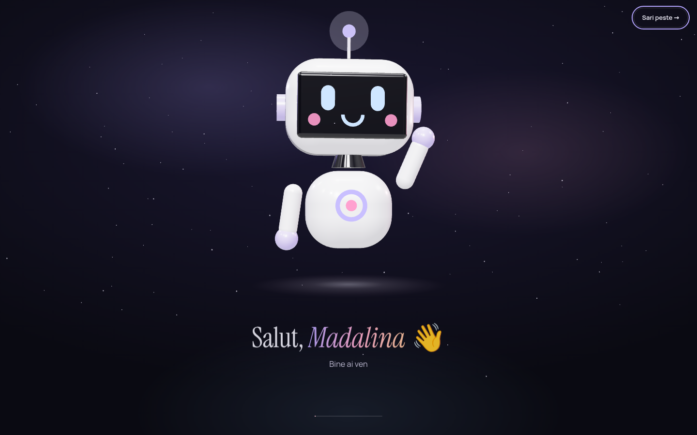
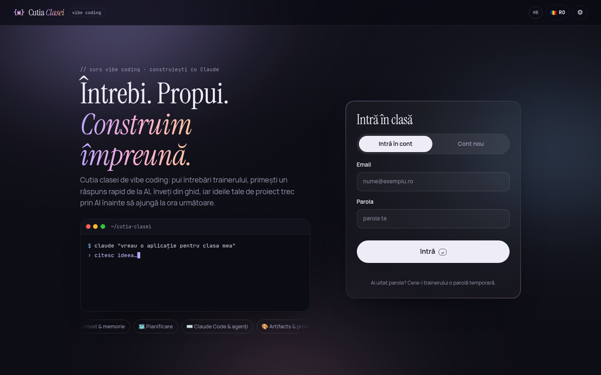
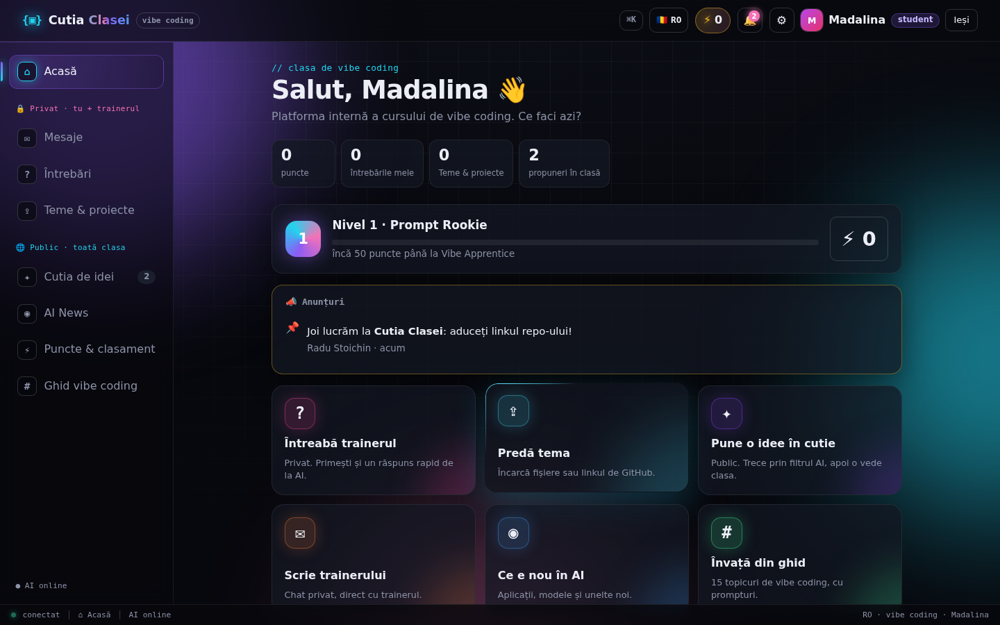
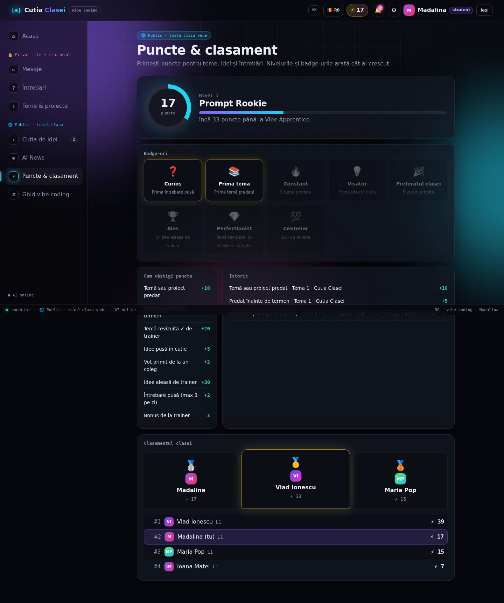
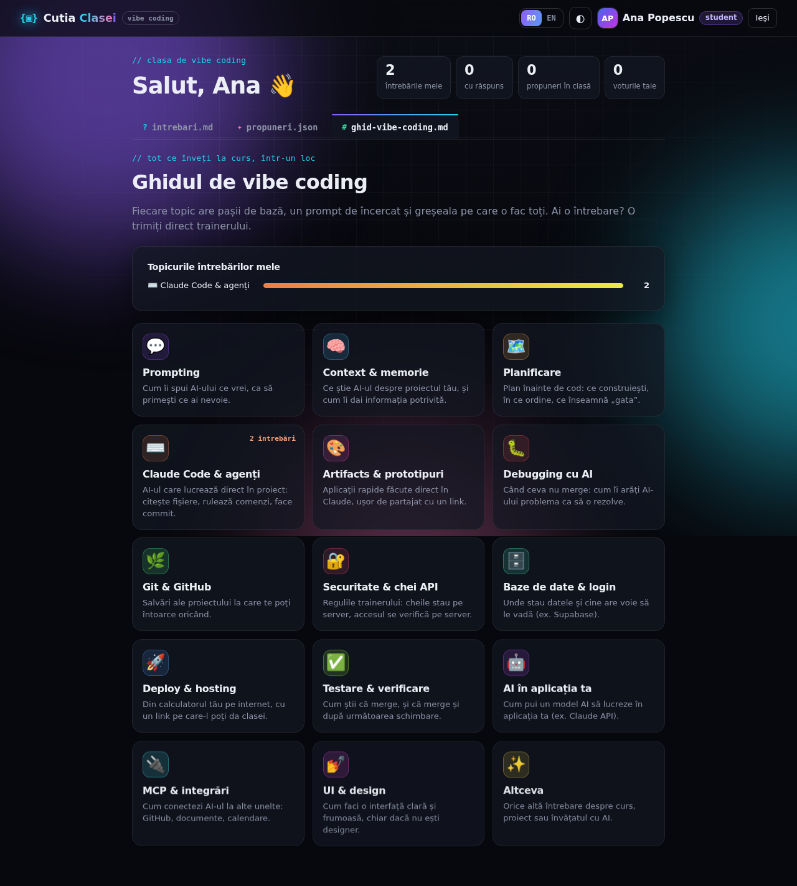
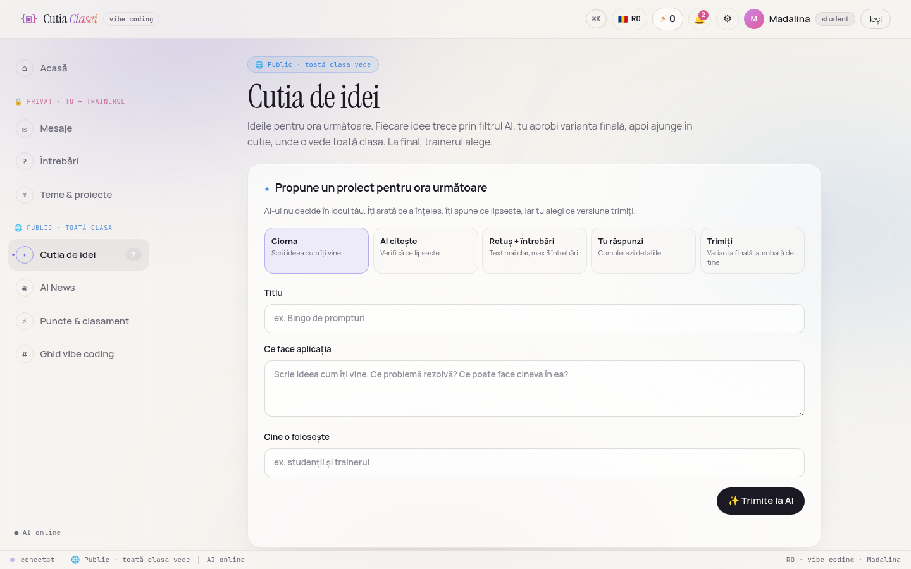
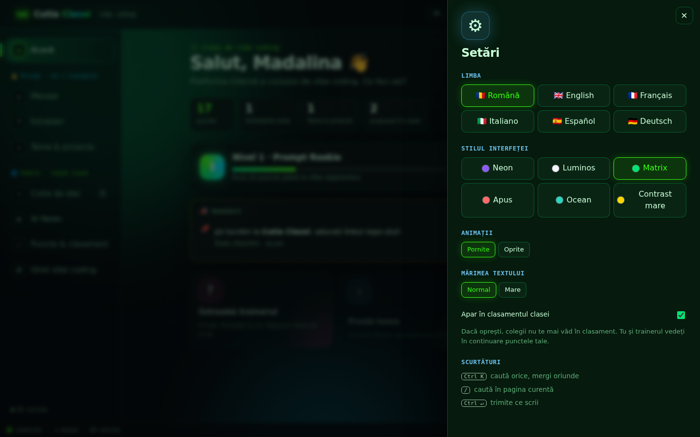
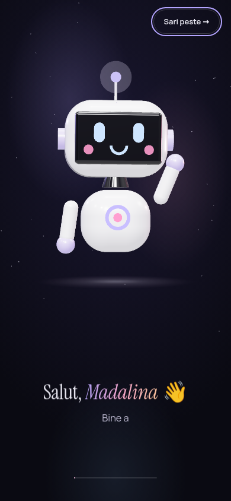

# {▣} Cutia Clasei

**Platforma internă a cursului de vibe coding.** Fiecare student are un spațiu privat cu trainerul (mesaje, întrebări, teme), iar clasa are un spațiu public (cutia de idei cu filtru AI, AI News, clasament, ghid). Interfața merge în **6 limbi** (RO, EN, FR, IT, ES, DE), are un design elegant „Aurora” (5 stiluri vizuale) și un **robot 3D** care te salută pe nume când intri.



## Ce face aplicația

| Spațiu | Ce găsești |
| --- | --- |
| 🔒 **Privat** (doar tu și trainerul) | **Mesaje directe:** chat privat cu trainerul. **Întrebări:** pe topicuri, cu răspuns rapid de la AI și răspunsul oficial al trainerului. **Teme & proiecte:** predai fișiere, linkul GitHub și checklist-ul temei, pentru temele anunțate de trainer (cu termen); primești feedback. **Atelier:** Verifică repo-ul, Error Doctor, Prompt Lab. |
| 🌐 **Public** (toată clasa) | **Ora live:** „M-am blocat” anonim, vot rapid, întrebări cu ▲, bilet de ieșire. **Cutia de idei:** AI-ul retușează ideea și cere detalii doar unde lipsesc; tu aprobi; clasa votează; trainerul alege; ideea aleasă primește un kit de start. **Demo Day:** aplicațiile terminate ale clasei. **AI News:** briefing-ul zilei de la Byte + știri filtrate. **Puncte & clasament:** niveluri, badge-uri, serii, misiuni săptămânale. **Ghid de vibe coding:** 15 topicuri, întrebări frecvente, Hall of Prompts. |

### Minimul obligatoriu

| Funcție | Cum e implementată |
| --- | --- |
| Pune o întrebare | O văd doar studentul care a pus-o și trainerul (verificat pe server). |
| Răspuns | Trainerul răspunde (sau editează), studentul vede răspunsul. |
| Scrie o propunere | Titlu, ce face aplicația, cine o folosește. |
| Modul AI | Arată ce a înțeles, retușează textul și pune **maxim 3 întrebări**, doar despre ce lipsește: problema, funcțiile, datele, mărimea. |
| Trimite propunerea | Studentul bifează „Am citit și aprob” înainte de trimitere; orice editare cere o nouă aprobare. Serverul refuză propunerile neaprobate. |
| Trainerul alege | Trainerul vede toate propunerile și le marchează „Aleasă”. |

### Funcții în plus

- **Robotul de bun venit (3D):** un robot construit în Three.js urcă pe ecran, îți face cu mâna, te urmărește cu privirea și îți spune „Salut, Madalina!”. După 7 secunde se deschide interfața (sau apeși „Sari peste”). Se poate opri din Setări și nu apare dacă ai animațiile oprite.
- **Propunerile mele:** trimiți câte propuneri vrei și le vezi pe toate într-un loc. O propunere se poate **retrage** (de exemplu „✓ Am rezolvat problema”, cu un mesaj opțional): iese din cutia publică, dar autorul și trainerul o văd în continuare, iar autorul o poate pune înapoi oricând.
- **Ciorne:** propunerile la care lucrezi se salvează automat pe server (cel mult 20 per student), le continui oricând din „Ciornele mele”. Textul nescris din întrebări, mesaje și teme rămâne în browser până îl trimiți și se șterge la „Ieși”, ca să nu-l vadă următorul pe un calculator comun.
- **Atelier** (🔒 privat), trei unelte pentru student:
  - **Verifică repo-ul:** lipești linkul de GitHub și primești lista „Gata când” a trainerului bifată automat: README cu „ce face / cum se pornește / funcții în plus”, link live, `.env` în `.gitignore`, niciun `.env` urcat și **nicio cheie API în cod sau în istoricul commiturilor** (cheile găsite apar mascate, cu sfatul să le regenerezi). Butonul apare și la predarea temei, iar trainerul îl are la fiecare temă cu link GitHub.
  - **Error Doctor 🩺:** lipești o eroare sau o captură de ecran (și cu Ctrl+V); primești ce înseamnă, cauza probabilă, pașii și promptul gata de pus în Claude Code. Cheile API lipite din greșeală se ascund înainte de orice. Fără AI recunoaște cele mai dese 12 tipuri de erori.
  - **Prompt Lab 🧪:** notează promptul pe 4 criterii (context, obiectiv, reguli, exemple), dă sfaturi și o variantă mai bună; cele mai bune ajung în **Hall of Prompts** (public, în Ghid), cu ♥.
- **Ora live 🔴:** trainerul pornește ora; studenții văd „LIVE” în meniu și primesc notificare. Butonul **„🙋 M-am blocat”** e anonim (trainerul vede doar câți sunt), **vot rapid** cu rezultate după ce votezi, **coada de întrebări** (și anonime) cu ▲, iar la final **biletul de ieșire** (răspunsurile le vede doar trainerul). După oră, clasa e trimisă spre Cutia de idei.
- **Demo Day ★:** aplicațiile terminate, cu link live, repo și captură; colegii reacționează (🔥👏💡🤯), trainerul alege **proiectul săptămânii**. +10 puncte per proiect (max 3), +25 pentru proiectul săptămânii.
- **Kit de start 🚀:** la o idee aleasă de trainer: primul prompt de pus în Claude, planul pentru prima oră, ce urmează și lista „Gata când”.
- **Serii și misiuni săptămânale:** 🔥 zile la rând în care ai lucrat, plus 4 misiuni pe săptămână (aceleași pentru toată clasa, altele în fiecare săptămână), +5 puncte fiecare. Badge-uri noi: „De neoprit” (7 zile) și „Maestrul misiunilor”.
- **Recap-ul săptămânii (trainer):** pe Acasă, cifrele ultimelor 7 zile, subiectele, cine n-a mai intrat și, cu AI, un rezumat și ce merită reluat la ora următoare. La Claude ajung doar textele întrebărilor și răspunsurilor, niciodată nume.
- **Întrebări frecvente:** trainerul publică răspunsuri (și din propunerile recap-ului); toată clasa le vede în Ghid.
- **Aplicație pe telefon 📲:** se instalează pe ecranul principal (Android, iPhone, calculator), se deschide și fără internet (ultima versiune), cu **notificări push**: răspunsul trainerului, mesaje, feedback, idee aleasă, temă nouă, ora live, briefing-ul lui Byte. Notificările sunt în limba fiecăruia, fără conținut privat pe ecranul blocat.
- **Conturi prin Supabase Auth** (recomandat): confirmare pe email la cont nou, „Ai uitat parola?” cu link pe email, „Continuă cu Google” și parole păstrate de Supabase, nu de noi. Serverul verifică la Supabase fiecare token înainte să te lase să intri.
- **Fără Supabase:** conturi cu email + parolă (sau **Google**, dacă e configurat). Trainerul e recunoscut după email. Cod de clasă opțional, ca doar colegii tăi să-și poată face cont.
- **Numele tău, automat:** sesiunea rămâne activă (și după repornirea serverului). Aplicația te salută pe nume peste tot, iar la revenire îți spune „Bine ai revenit, Madalina!”.
- **Mesaje directe** student ↔ trainer, cu mesaje necitite și notificări.
- **Teme anunțate de trainer** cu termen, puncte și numărătoare inversă; **anunțuri** fixate pe pagina de acasă.
- **Credite & puncte bonus:** puncte pentru teme (+10), predare la timp (+5), temă revizuită (+20 sau cât stabilește trainerul), idei (+5), voturi primite (+2), idee aleasă (+30), întrebări (+2, max 3/zi) și bonusuri de la trainer. 6 niveluri (Prompt Rookie → AI Wizard), 8 badge-uri, podium și clasament (poți alege să nu apari).
- **Byte, robotul de știri 🤖 (briefing-ul zilei):** o dată la 24 de ore (implicit la 07:00, ora României) Byte citește toate sursele și păstrează ce a apărut în ultimele 24 de ore. Cu cheie API, Claude scrie briefing-ul pentru clasă:
  - un titlu și un rezumat al zilei;
  - 5–7 știri, fiecare cu „de ce contează” și „💡 pentru tine” (ce poți încerca sau construi cu ea);
  - **unealta zilei**, cu un prompt gata de copiat în Claude;
  - o **provocare de 15 minute** cu 3 pași de bifat;
  - **cuvântul zilei** și **pulsul zilei** (cât de mare a fost ziua în AI).

  Byte arată câte surse și câte știri a citit, iar briefing-ul se poate **asculta** (citit cu voce în limba ta), copia pentru grupul clasei sau răsfoi pe zilele trecute. Primești notificare când e gata. Trainerul îl poate face din nou oricând.

  Claude alege știrile doar din listă, iar linkurile le punem noi din surse, deci nu poate inventa știri. Fără cheie, Byte face un briefing din scorul știrilor, iar provocarea vine din ghid.
- **AI News:** știri din surse publice despre AI (TechCrunch, The Verge, MIT Technology Review, Ars Technica, VentureBeat, Wired, The Decoder, Hugging Face, Google AI, Google DeepMind, OpenAI, GitHub Blog, Latent Space, Simon Willison, Hacker News), filtrate după relevanță (aplicații noi, modele, unelte, „wow”), pe categorii. Cu cheie API, Claude alege cele mai bune și explică „de ce contează” în limba ta. Din orice știre: „Trimite trainerului” sau „Fă o idee din asta”.
- **Răspuns rapid de la AI** la fiecare întrebare, marcat „neverificat de trainer”.
- **6 limbi** (RO, EN, FR, IT, ES, DE): interfață, erori de server, texte AI și ghid. Limba aleasă te urmează pe orice dispozitiv.
- **Design „Aurora”:** fundal adânc cu lumini de auroră discrete și grăunte fin de film, titluri în serif elegant (Instrument Serif), text în Manrope, butoane calme în formă de pastilă. 5 stiluri: Aurora, Perlă (luminos), Apus, Ocean, Contrast mare. Plus animații pornite/oprite și text normal/mare.
- **Ușor de folosit:** pagină de acasă cu acțiuni rapide, tur de bun venit la prima intrare, notificări 🔔, paleta de comenzi `Ctrl+K` (mergi oriunde, schimbi limba sau stilul), `/` pentru căutare, `Ctrl+Enter` pentru trimitere, meniu jos pe telefon.

| Login | Acasă | Puncte & clasament |
| --- | --- | --- |
|  |  |  |

| Ghidul | Cutia de idei (stilul Perlă) | Setări | Telefon |
| --- | --- | --- | --- |
|  |  |  |  |

## Cum se pornește

```bash
pip install -r requirements.txt
cp .env.example .env          # opțional: pune ANTHROPIC_API_KEY și TRAINER_CODE aici
uvicorn src.app:app --reload
```

Deschide http://localhost:8000.

- **Cum intri:** cu **emailul tău personal și o parolă** (minim 8 caractere). Prima dată alegi „Cont nou”. Dacă serverul are `GOOGLE_CLIENT_ID`, apare și butonul **„Continuă cu Google”**.
- **Trainerul:** emailul lui e în `TRAINER_EMAILS`, așa că intră direct ca trainer. Alternativ, își face cont cu codul de trainer (`TRAINER_CODE`).
- **Doar clasa ta:** dacă setezi `CLASS_CODE`, un student își poate face cont doar cu codul clasei, primit de la trainer.
- **Ai uitat parola?** Cu Supabase: „Ai uitat parola? Primești un link pe email.” (sau trainerul îți trimite linkul din Puncte). Fără Supabase: trainerul îți generează o parolă temporară, iar tu o schimbi din Setări.
- **Fără cheie API** aplicația merge complet: propunerile se retușează local, la întrebări apar sfaturi din ghid, iar știrile sunt filtrate automat (fără explicațiile lui Claude).
- **AI News** are nevoie de acces la internet pe server, ca să citească sursele.

| Variabilă | Implicit | Rol |
| --- | --- | --- |
| `ANTHROPIC_API_KEY` | – | Activează AI-ul (doar pe server). |
| `TRAINER_EMAILS` | – | Emailurile trainerilor, separate prin virgulă. |
| `TRAINER_CODE` | – | Codul cu care un trainer își poate face cont (minim 6 caractere). Codurile știute de toți, ca `trainer` sau `schimba-ma`, sunt ignorate. |
| `CLASS_CODE` | – | Dacă e setat, studenții au nevoie de el ca să-și facă cont. |
| `SUPABASE_URL` | – | Adresa proiectului Supabase (`https://xxxx.supabase.co`). Împreună cu cheia de mai jos, pornește conturile prin Supabase. |
| `SUPABASE_ANON_KEY` | – | Cheia **anon / publishable** a proiectului. Niciodată `service_role`. |
| `SUPABASE_SECRET_KEY` | – | Doar pe server: datele și fișierele aplicației în Supabase (vezi mai jos). |
| `GOOGLE_CLIENT_ID` | – | Fără Supabase: activează „Continuă cu Google” (Client ID din Google Cloud Console). |
| `VAPID_PUBLIC_KEY` / `VAPID_PRIVATE_KEY` / `VAPID_SUBJECT` | – | Notificările push. Le generezi o dată cu `python -m src.webpush`. |
| `GITHUB_TOKEN` | – | Opțional, pentru „Verifică repo-ul”: un token doar de citire ridică limita GitHub de la 60 la 5000 de cereri pe oră. |
| `CUTIA_AI` | `auto` | `auto` / `on` / `off` |
| `CUTIA_MODEL` | `claude-opus-5-5` | Modelul Claude. |
| `CUTIA_DATA` | `data/cutia.json` | Unde se salvează datele. |
| `CUTIA_UPLOADS` | `data/uploads` | Unde se salvează fișierele încărcate. |
| `CUTIA_NEWS_FEEDS` | sursele de mai sus | Alte surse: `Nume\|https://...,Nume\|https://...` |
| `CUTIA_DIGEST_HOUR` | `7` | Ora la care Byte face briefing-ul zilei. |
| `CUTIA_TZ` | `Europe/Bucharest` | Fusul orar pentru ora de mai sus. |
| `CUTIA_DIGEST_LANGS` | `ro,en` | Limbile scrise dimineața; celelalte se scriu la prima vizită și rămân salvate. |
| `CUTIA_DIGEST` | `on` | `off` oprește robotul (briefing-ul se face doar la cerere). |
| `CUTIA_NEWS_CACHE` | `7200` | Cât timp (secunde) păstrăm știrile înainte să le recitim. |

### Conturi prin Supabase (pas cu pas)

1. Fă-ți cont gratuit pe [supabase.com](https://supabase.com) și creează un proiect nou.
2. **Project Settings → API**: copiază *Project URL* în `SUPABASE_URL` și cheia *anon public* în `SUPABASE_ANON_KEY` (în `.env` sau la serverul de hosting).
3. **Authentication → Sign In / Providers → Email**: lasă **Confirm email** pornit. Doar așa știm că emailul chiar e al tău (altfel oricine s-ar putea înscrie cu emailul trainerului).
4. **Authentication → URL Configuration**: pune la *Site URL* adresa aplicației (de exemplu `http://localhost:8000/static/index.html`, apoi linkul live) și adaug-o și la *Redirect URLs*. Acolo te întorc linkurile din email.
5. (opțional) **Google**: în *Sign In / Providers → Google* pui Client ID și Secret din Google Cloud Console; butonul „Continuă cu Google” apare singur.
6. Repornește serverul. Pe pagina de intrare apare „🔐 conturi securizate prin Supabase”.

### Toate datele în Supabase (recomandat pentru publicare)

Pe lângă conturi, Supabase poate păstra **toate datele** (întrebări, teme, idei, mesaje, puncte) și **fișierele** (teme, capturi). Așa serverul poate fi repornit oricând fără să se piardă nimic, iar Render merge pe planul gratuit.

1. În Supabase → **SQL Editor**, lipește conținutul fișierului `supabase/schema.sql` și apasă **Run**. Se creează tabelul `cutia_state` (cu Row Level Security pornit și fără politici: browserul nu poate citi nimic din el) și bucket-ul privat `cutia-files`.
2. **Project Settings → API Keys**: copiază cheia **secret** (`sb_secret_…`) în `SUPABASE_SECRET_KEY`. Ea stă **doar pe server** (`.env` sau Render → Environment), niciodată în cod, în browser sau pe GitHub.
3. Repornește serverul. La prima pornire, dacă tabelul e gol și ai date în `data/cutia.json`, se mută singure. Pentru fișierele vechi: `python -m src.store migrate`.
4. `GET /api/health` arată `"storage": "supabase"`.

Fără `SUPABASE_SECRET_KEY`, datele rămân în `data/cutia.json`, ca până acum.

**Teste:** `pytest` (acces cu două conturi, mesaje private, puncte, upload, știri, AI și toate cele 6 limbi).

## Publică online (linkul live)

Aplicația e pregătită pentru [Render](https://render.com) prin fișierul `render.yaml`.

1. Fă-ți cont pe **render.com** cu contul de GitHub.
2. **New → Blueprint**, alegi acest repo și apeși **Apply**.
3. Render îți cere valorile secrete; le completezi doar acolo, niciodată în cod:
   - `ANTHROPIC_API_KEY`: cheia ta API (opțional);
   - `TRAINER_EMAILS`: emailul trainerului;
   - `TRAINER_CODE`: un cod al tău de minim 6 caractere (opțional);
   - `CLASS_CODE`: codul clasei (opțional);
   - `SUPABASE_URL`, `SUPABASE_ANON_KEY` și `SUPABASE_SECRET_KEY`: din pașii de mai sus;
   - `VAPID_PUBLIC_KEY`, `VAPID_PRIVATE_KEY`, `VAPID_SUBJECT`: pentru notificări (opțional).
4. După 2–3 minute primești linkul, de forma `https://cutia-clasei-xxxx.onrender.com`.
5. Cu Supabase: pune linkul + `/static/index.html` la *Site URL* și *Redirect URLs* (Authentication → URL Configuration).
6. Scrie linkul mai jos, la „Aplicația live”.

De aici, fiecare `git push` publică automat versiunea nouă.

**Cost: 0.** Datele și fișierele stau în Supabase, deci Render merge pe planul **Free**. Pe planul gratuit, serverul „adoarme” după 15 minute fără vizite și se trezește în ~1 minut la prima vizită; datele nu se pierd (se scriu în Supabase la fiecare schimbare și la oprire). Briefing-ul lui Byte se face la prima vizită de după ora 7. Proiectele Supabase gratuite se pun pe pauză după o săptămână fără activitate; le repornești din panoul Supabase.

**Aplicația live:** încă nu e publicată online. Linkul apare aici după deploy.

## Securitate

- Cheia API stă doar pe server (variabilă de mediu / `.env`, ignorat de git) și nu ajunge niciodată în browser. Un test verifică asta.
- Toate regulile de acces se verifică pe server și sunt testate cu două conturi: studentul B nu vede întrebările, temele, fișierele sau mesajele studentului A.
- Sesiunile se salvează doar ca hash, iar parolele ca hash PBKDF2. „Ieși” închide sesiunea pe server.
- După 5 parole greșite, contul se blochează 10 minute. Același mesaj pentru email greșit și parolă greșită, ca să nu se poată afla cine are cont.
- Supabase: parolele stau la Supabase, nu la noi. Orice token venit din browser (linkul din email, Google) e verificat de server la Supabase înainte de a deschide o sesiune, iar din bara de adrese e șters imediat. Pe server stă doar anon key, niciodată `service_role`. Emailul din `TRAINER_EMAILS` dă rol de trainer doar dacă emailul e dovedit (confirmare pe email sau Google).
- Datele în Supabase: tabelul are Row Level Security fără nicio politică, deci cheia publică nu poate citi nimic; serverul folosește cheia secretă, ținută doar în variabilele lui de mediu. Dacă Supabase nu răspunde la pornire, serverul nu pornește (nu riscăm să suprascriem datele cu nimic).
- „Verifică repo-ul” vorbește doar cu `api.github.com` și `raw.githubusercontent.com`, cu owner/repo validate strict; cheile găsite se arată mascate.
- Error Doctor și Prompt Lab ascund cheile API din text înainte să-l salveze sau să-l trimită la Claude.
- Notificările push sunt criptate pentru fiecare dispozitiv (RFC 8291) și semnate cu cheia serverului (VAPID); textul lor e generic.
- Capturile (Error Doctor, Demo Day) se acceptă doar ca PNG/JPEG/WebP verificate după conținut și se servesc cu `nosniff`, doar celor logați.
- Google: tokenul semnat de Google se verifică pe server (cu biblioteca oficială `google-auth`), doar pentru emailuri verificate.
- Punctele se calculează pe server din activitatea reală, nu pot fi modificate din browser; nu îți poți vota propria idee.
- Fișierele se salvează cu nume aleatorii și se descarcă doar ca atașament, după verificarea accesului.
- Codul de trainer nu are valoare implicită: codurile știute de toți (din README sau `.env.example`) sunt ignorate, ca nimeni să nu devină trainer cu ele.
- Datele se salvează printr-un fișier temporar înlocuit dintr-o mișcare, ca o oprire bruscă a serverului să nu strice fișierul.
- Știrile din internet sunt tratate ca date: fără HTML, doar linkuri `http(s)`, iar AI-ul le primește ca date, nu ca instrucțiuni.

## Decizii tehnice (motiv → soluție)

- **Cheia API nu are voie în browser** → AI-ul e chemat doar din `src/ai.py` și `src/news.py`, pe server.
- **Spațiul privat trebuie să fie chiar privat** → fiecare endpoint filtrează după autor pe server, plus teste cu două conturi.
- **Punctele trebuie să fie corecte și greu de trișat** → nu se salvează ca număr; `src/points.py` le calculează mereu din teme, idei, voturi și bonusuri.
- **Un briefing pe zi, nu un flux nesfârșit** → Byte rulează pe server o dată la 24 de ore; fiecare limbă se scrie o singură dată pe zi și se salvează, deci costă câteva apeluri pe zi, indiferent câți colegi îl deschid. Dacă AI-ul nu merge, reîncearcă abia peste 30 de minute.
- **Știrile trebuie să fie relevante, nu zgomot** → filtru pe cuvinte cheie (lansări, unelte, modele, agenți) și penalizare pentru bani, procese și politică; cu cheie, Claude alege și explică.
- **Aplicația trebuie să meargă și fără AI** → mod local pentru retușare, sfaturi din ghid și filtru automat de știri.
- **AI-ul nu decide în locul studentului** → răspuns structurat (JSON), maxim 3 întrebări, trimitere doar cu aprobare verificată pe server.
- **Clasa e internațională** → toate textele în `src/static/i18n/<limbă>.js`; se încarcă doar limba aleasă; un test verifică să nu lipsească nicio traducere.
- **Parolele și emailurile de resetare sunt greu de făcut bine singur** → Supabase Auth (opțional), apelat de pe server prin API-ul REST, fără supabase-js (fără build, fără dependențe noi).
- **Simplu de rulat la curs** → FastAPI + HTML/CSS/JS fără build; datele într-un fișier JSON.
- **Robotul 3D trebuie să meargă oriunde, fără CDN** → Three.js și fonturile sunt incluse local (`src/static/vendor/`, `src/static/fonts/`); fără WebGL sau cu animațiile oprite, intri direct în aplicație.
- **Design elegant, nu încărcat** → puține culori (lavandă, cer, roz, piersică), mult spațiu, fără strălucire neon; serif pentru titluri, sans pentru text.

## Structura

```
src/app.py               API (FastAPI): conturi, mesaje, întrebări, teme, idei, puncte, știri
src/ai.py                Modulul AI (Claude): retușarea ideilor + tutorul pentru întrebări
src/news.py              AI News: surse RSS/Atom, filtrare, cache, alegere cu Claude
src/digest.py            Byte: briefing-ul zilei (ultimele 24h, scris de Claude o dată pe zi)
src/points.py            Puncte, niveluri, badge-uri, serii și misiuni săptămânale
src/repocheck.py         „Verifică repo-ul”: README, .env, chei API în cod și în istoric
src/tools.py             Error Doctor, Prompt Lab, kit de start, recap (cu Claude + variante locale)
src/store.py             Datele și fișierele în Supabase (Postgres + Storage), scriere în fundal
src/webpush.py           Notificări push (RFC 8291 + VAPID)
src/static/sw.js         Service worker: aplicația instalabilă, offline, notificări
supabase/schema.sql      Tabelul și bucket-ul din Supabase (rulat o dată)
src/supa.py              Conturi prin Supabase Auth (opțional): verificare token, resetare parolă
src/static/              Interfața: index.html, app.js, styles.css
src/static/i18n/         Textele în 6 limbi (ro, en, fr, it, es, de)
src/static/intro.js      Robotul 3D de bun venit (Three.js)
src/static/vendor/       Three.js (licență MIT), inclus local
src/static/fonts/        Fonturile (SIL Open Font License), incluse local
tests/                   Teste (pytest) + verificarea traducerilor
CLAUDE.md                Regulile proiectului pentru Claude
render.yaml              Publicarea pe Render (disc permanent pentru date, fără chei în fișier)
```
