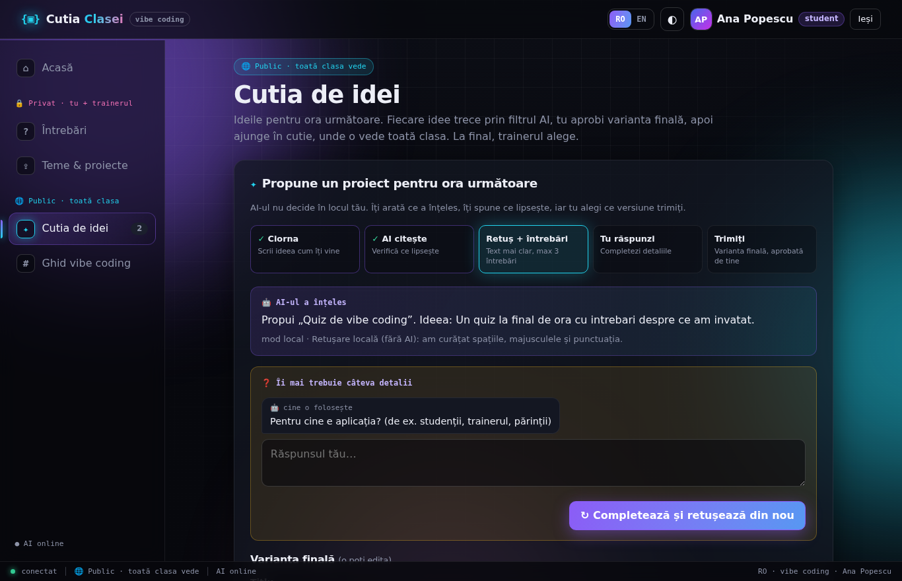
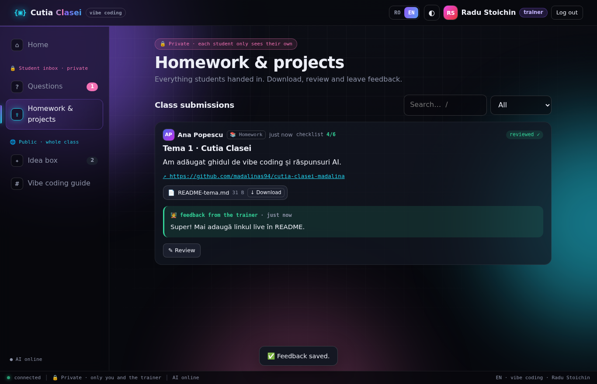
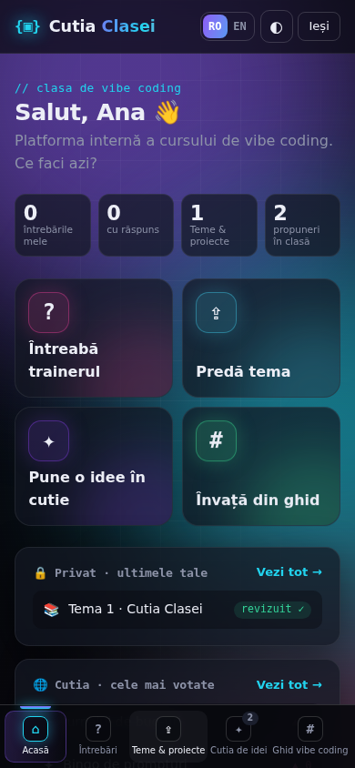

# {▣} Cutia Clasei

**Platforma internă a cursului de vibe coding.** Studenții pun întrebări trainerului, predau teme și proiecte în spațiul lor privat și pun idei pentru ora următoare într-o cutie publică, după ce trec printr-un filtru AI. Interfața e în **română și engleză**.


## Ce face aplicația

| Spațiu | Ce găsești |
| --- | --- |
| 🔒 **Privat** (doar tu și trainerul) | **Întrebări:** pui o întrebare (cu topic), primești un răspuns rapid de la AI, iar trainerul răspunde oficial. **Teme & proiecte:** încarci fișiere, pui linkul repo-ului GitHub, bifezi checklist-ul temei și primești feedback. |
| 🌐 **Public** (toată clasa) | **Cutia de idei:** propui un proiect, AI-ul îl retușează și cere detalii doar unde lipsesc, tu aprobi, apoi ideea intră în cutie, unde clasa o votează și trainerul o marchează „Aleasă”. **Ghid de vibe coding:** 15 topicuri, fiecare cu pașii de bază, un prompt de copiat și greșeala clasică. |

### Minimul obligatoriu

| Funcție | Cum e implementată |
| --- | --- |
| Pune o întrebare | O văd doar studentul care a pus-o și trainerul (verificat pe server). |
| Răspuns | Trainerul răspunde (sau editează), studentul vede răspunsul. |
| Scrie o propunere | Titlu, ce face aplicația, cine o folosește. |
| Modul AI | Arată ce a înțeles, retușează textul și pune **maxim 3 întrebări**, doar despre ce lipsește: problema, funcțiile, datele, mărimea. |
| Trimite propunerea | Studentul bifează „Am citit și aprob” înainte de trimitere; orice editare cere o nouă aprobare. Serverul refuză propunerile neaprobate. |
| Trainerul alege | Trainerul vede toate propunerile și le marchează „Aleasă”. |

### Funcții în plus

- **Spațiu privat pentru teme & proiecte:** drag & drop, până la 5 fișiere (10 MB fiecare), bară de progres, link GitHub, checklist-ul „Gata când” și cei 5 pași de predare pe GitHub. Trainerul descarcă fișierele, setează statusul (primit / revizuit / de refăcut) și lasă feedback.
- **Răspuns rapid de la AI** la fiecare întrebare, marcat „neverificat de trainer”. Trainerul îl poate folosi ca ciornă.
- **Ghid de vibe coding** cu 15 topicuri (prompting, context, planificare, Claude Code, artifacts, debugging, Git, securitate & chei API, baze de date & RLS, deploy, testare, AI în aplicație, MCP, design) și statistici despre ce întreabă clasa.
- **Română / English** pentru tot: interfață, erori, AI.
- Pagina de acasă cu acțiuni rapide, voturi pe idei, întrebări anonime, topicuri, căutare și filtre.
- Design futurist: dark / light, terminal animat, confetti, scurtături (`/` caută, `Ctrl+Enter` trimite). Merge pe telefon și respectă `prefers-reduced-motion`.

| Cutia de idei | Ghidul | Trainer: teme (EN) | Telefon |
| --- | --- | --- | --- |
|  |  |  |  |

## Cum se pornește

```bash
pip install -r requirements.txt
cp .env.example .env          # opțional: pune ANTHROPIC_API_KEY și TRAINER_CODE aici
uvicorn src.app:app --reload
```

Deschide http://localhost:8000.

- **Student:** intri cu numele și o parolă. Prima dată îți creezi contul, apoi intri cu aceeași parolă.
- **Trainer:** intri cu numele și codul de trainer (`TRAINER_CODE`, implicit `trainer`, schimbă-l!).
- **Fără cheie API** aplicația merge complet: propunerile se retușează local, iar la întrebări apar sfaturi din ghid în loc de răspunsul AI.

| Variabilă | Implicit | Rol |
| --- | --- | --- |
| `ANTHROPIC_API_KEY` | – | Activează AI-ul (doar pe server). |
| `TRAINER_CODE` | `trainer` | Codul trainerului. |
| `CUTIA_AI` | `auto` | `auto` / `on` / `off` |
| `CUTIA_MODEL` | `claude-opus-5-5` | Modelul Claude. |
| `CUTIA_DATA` | `data/cutia.json` | Unde se salvează datele. |
| `CUTIA_UPLOADS` | `data/uploads` | Unde se salvează fișierele încărcate. |

**Teste:** `pytest` (acces cu două conturi, upload, AI, ambele limbi).

**Aplicația live:** încă nu e publicată online. Linkul apare aici după deploy.

## Securitate

- Cheia API stă doar pe server (variabilă de mediu / `.env`, ignorat de git) și nu ajunge niciodată în browser. Un test verifică asta.
- Toate regulile de acces se verifică pe server. Testat cu două conturi: studentul B nu vede întrebările și temele studentului A și nu le poate descărca fișierele.
- Fișierele se salvează cu nume aleatorii și se descarcă doar ca atașament, după verificarea accesului. Tipurile și mărimea sunt limitate.
- Parolele sunt salvate doar ca hash (PBKDF2).

## Decizii tehnice (motiv → soluție)

- **Cheia API nu are voie în browser** → AI-ul e chemat doar din `src/ai.py`, pe server; browserul vorbește doar cu API-ul nostru.
- **Întrebările și temele sunt private** → fiecare endpoint filtrează după autor pe server, plus teste cu două conturi.
- **Aplicația trebuie să meargă și fără AI** → mod local pentru retușare și sfaturi din ghid; AI-ul nu blochează nicio funcție obligatorie.
- **AI-ul nu decide în locul studentului** → răspuns structurat (JSON), maxim 3 întrebări, iar trimiterea cere aprobare explicită, verificată pe server.
- **Răspunsul AI poate greși** → e marcat „neverificat de trainer”, iar răspunsul trainerului rămâne cel oficial.
- **Fișierele încărcate pot fi periculoase** → listă de extensii permise, 10 MB maxim, nume aleatorii, descărcare doar ca `attachment` + `nosniff`.
- **Clasa e mixtă (RO/EN)** → toate textele stau în `src/static/i18n.js`, iar serverul răspunde în limba din antetul `X-Lang`.
- **Simplu de rulat la curs** → FastAPI + HTML/CSS/JS fără build; datele într-un fișier JSON.

## Structura

```
src/app.py          API (FastAPI)
src/ai.py           Modulul AI (Claude)
src/static/         Interfața: index.html, app.js, i18n.js, styles.css
tests/test_app.py   Teste
CLAUDE.md           Regulile proiectului pentru Claude
```
